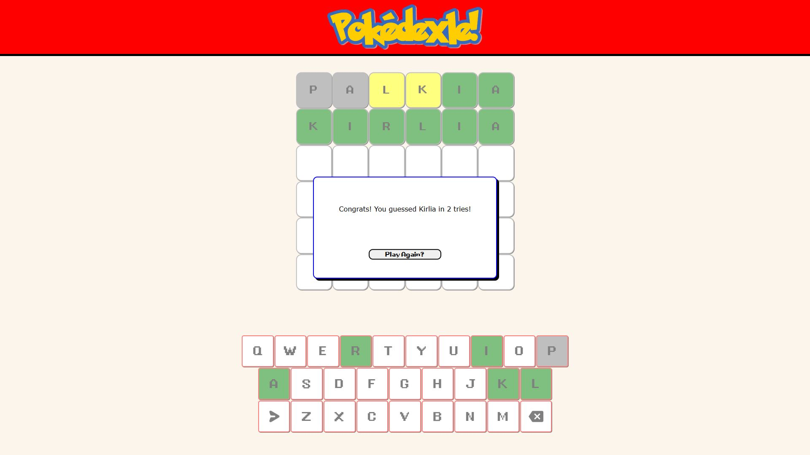

# Pokedexle
 Wordle clone using Pokemon names

## To-do:
- [x] Generate Letterboxes across 6 rows and n columns (n = name length)
- [x] Allow user input, one box at a time
- [x] Initiate end of line word checks, with yellow & green responses
- [x] Handle Win/Loss states
- [x] Tidy UI
- [x] Design a Favicon
- [ ] Optional: experiment with Pokemon data APIs? (Types, Pictures)

## Resources:
Pokemon Font: [Font Meme](https://fontmeme.com/pokemon-font/)\
Gameboy Font: [Fontspace](https://www.fontspace.com/gbboot-font-f2385)\
List of Names: [ralts00 Gist](https://gist.github.com/ralts00/31415709fb34c1b2ec556c396efc3d80)\
Fetch Text Example: [MDN Example](https://mdn.github.io/dom-examples/fetch/fetch-text/) & [Github Repo](https://github.com/mdn/dom-examples/tree/main/fetch/fetch-text)\
Pokemon data API: [PokeAPI](https://pokeapi.co)
